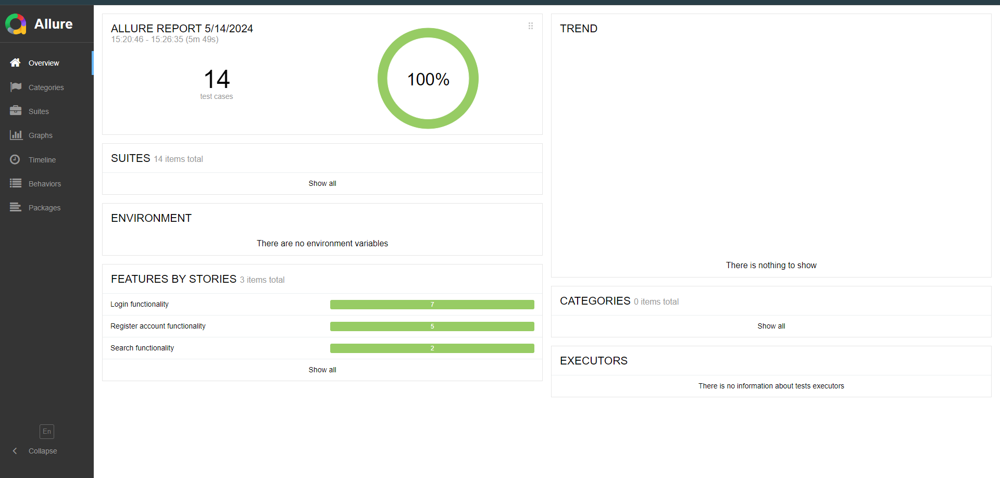
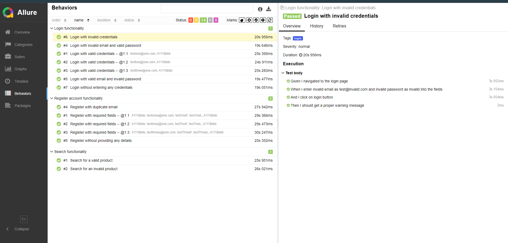
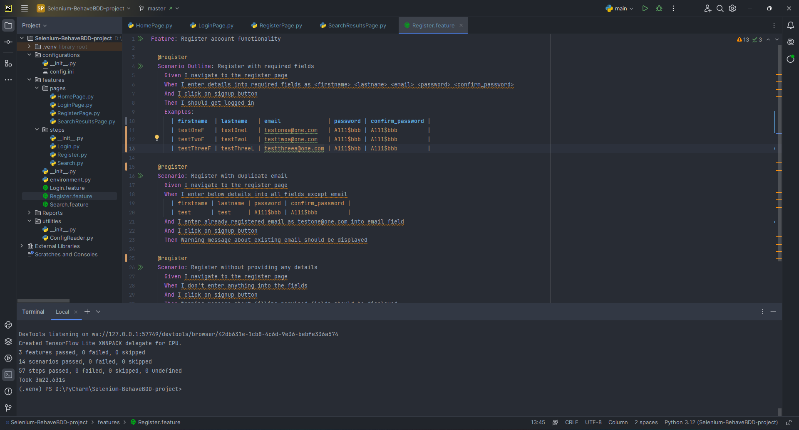

<h1 align="center">Selenium with Behave BDD Framework</h1>  

  This is a Selenium test automation project utilizing Python's Behave BDD framework integrated with the Page Object Model design pattern. The project consisted of three main features encompassing ten test scenarios, incorporating data-driven testing techniques. Additionally, I integrated Allure test reporting for comprehensive result analysis.

---

  Selenium | Behave BDD | Page Object Model | Data Driven Testing | Allure Reporting | Python

---

### Test Report:

 

 

### Screenshot:

